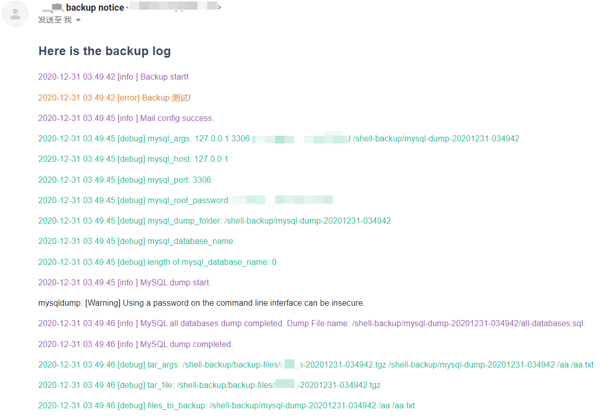
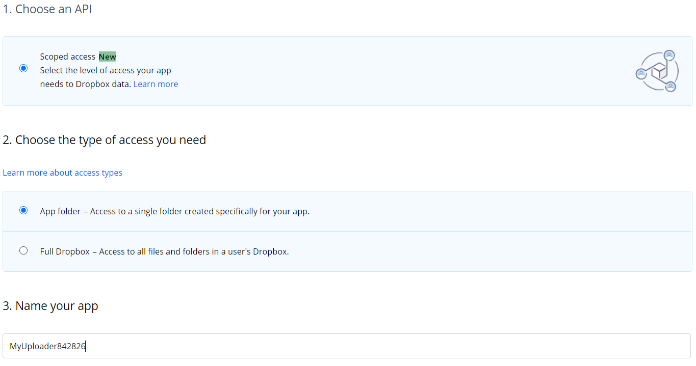
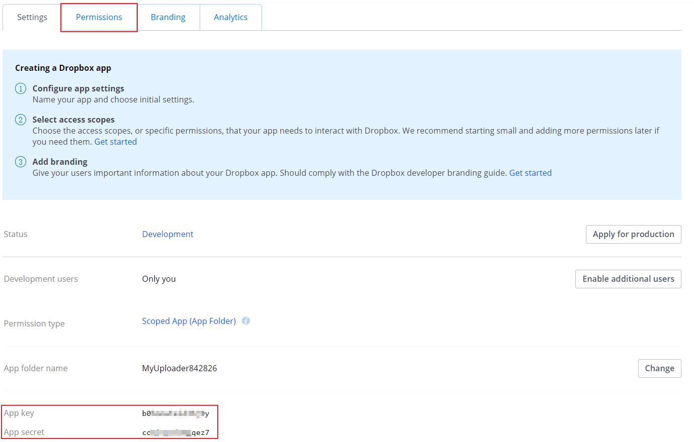
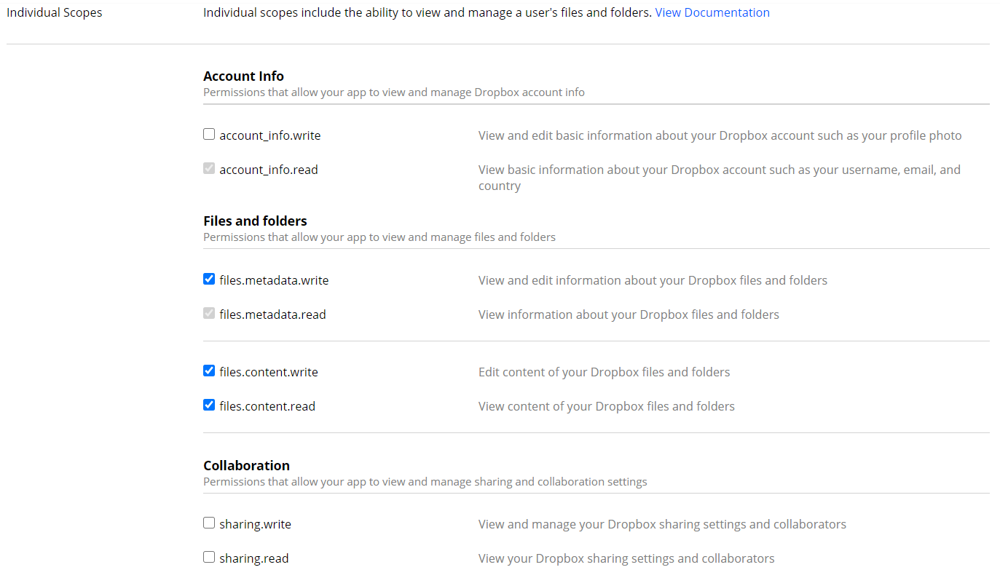
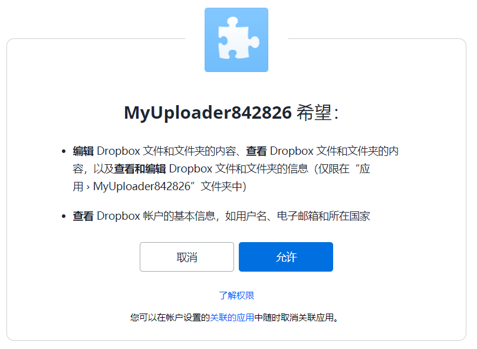
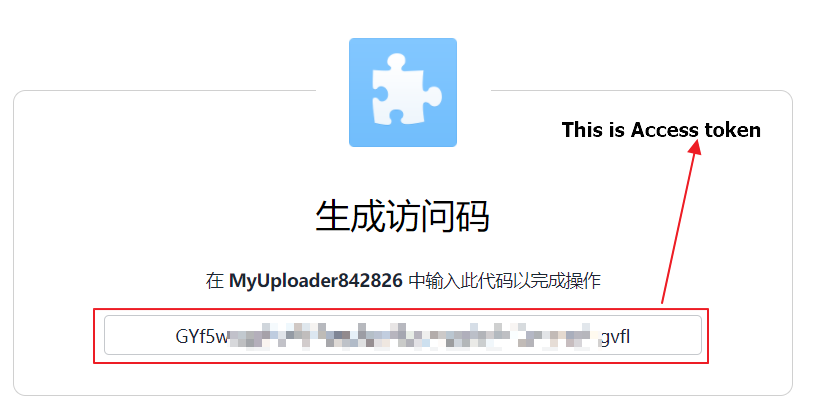

### 功能

- 备份文件夹、文件，MySQL数据库。
- 使用zip加密备份文件。
- 基于备份数量的滚动备份。在本地和云端保留指定的备份数量，超过后删除旧的备份。
- 自动上传Dropbox。
- Gmail通知。

   

### 安装

``` shell
git clone https://github.com/flatblowfish/server-backup.git
cd server-backup
chmod +x backup.sh
./backup.sh
```

### 配置

所有的配置选项都能在config.sh文件中找到。大多数的配置是直观的。下面仅仅说明一下重要的、模糊的选项。

```shell
#
# optional: debug/info/error
# 第一次运行设置为“debug”来发现错误
#
log_level=debug
#
# Keep how many backup files
# 当一个新的备份文件生成后，如果备份文件总数超过了这个值，那么最老的一个备份文件将会被删除
#
number_to_keep=3
#
# Mark different server backups
# 在邮件通知功能中也使用它来标记不同的备份
#
backup_prefix=""
#
# Dropbox folder to store backups
# 一个Dropbox app, 你是可以建立很多文件夹的
#
dropbox_folder=""
#
# Mail account
# 现在仅支持Gmail
#
mail_account=""
#
# 不写代表着不会备份MySQL数据库
#
mysql_root_password=""
#
# Encrypt password
# 不写代表着不会加密备份
#
encrypt_password=""
#
# Mail password
# 不写代表着不会进行邮件通知
#
mail_password=""
```

### Dropbox配置 - 获取App key、App secret、Access token

1. 登陆Dropbox，打开 https://www.dropbox.com/developers/apps/create ，点击 "Create App" 按钮。

2. 勾选 "Choose an API: Scoped Access"; "Choose the type of access you need: App folder"; "Name your app: "App Name" (必须是唯一的)。点击 "Create App" 按钮。

   

3. 记录下 App key、App secret 。

   

4. 切换到 "permissions" 选项栏，然后勾选 "files.metadata.read/write" and "files.content.read/write" ，点击 "Submit" 按钮。

   

5. 获取 Access token 。打开 https://www.dropbox.com/oauth2/authorize?client_id=App-key&token_access_type=offline&response_type=code ，**其中 App-key 是 "App key" ，记得替换**。

6. 注意：Dropbox-Uploader 程序使用 Access token 生成 Refresh token ，可以在 ~/.dropbox_uploader 中看到。Access token 只能被使用一次，所以怕麻烦可以备份 ~/.dropbox_uploader 。

   
   

