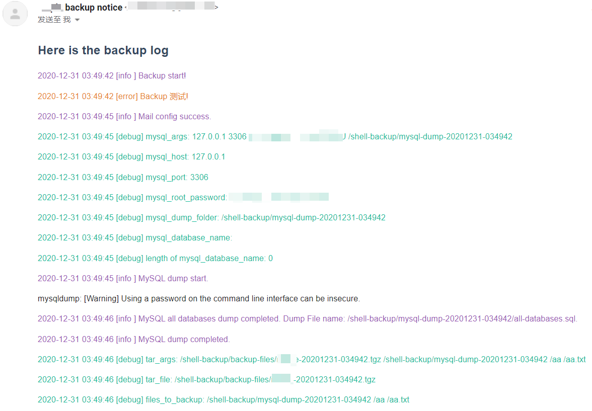
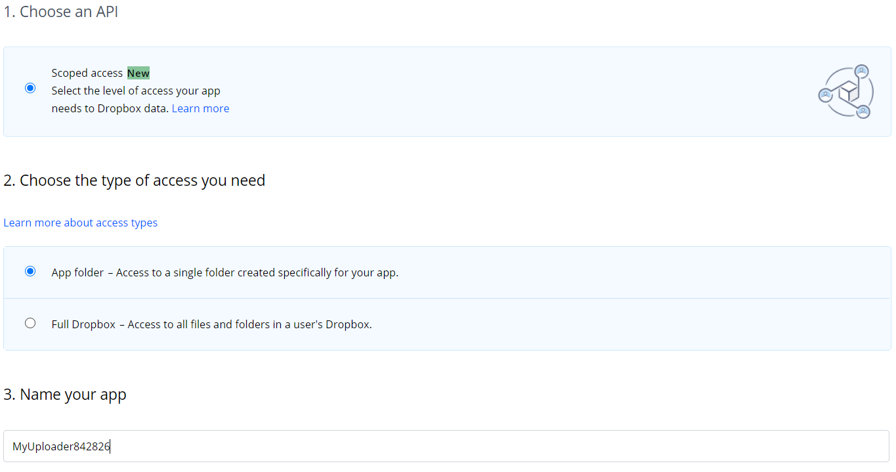
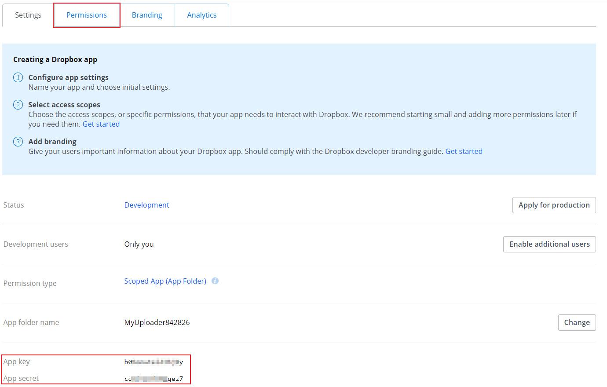
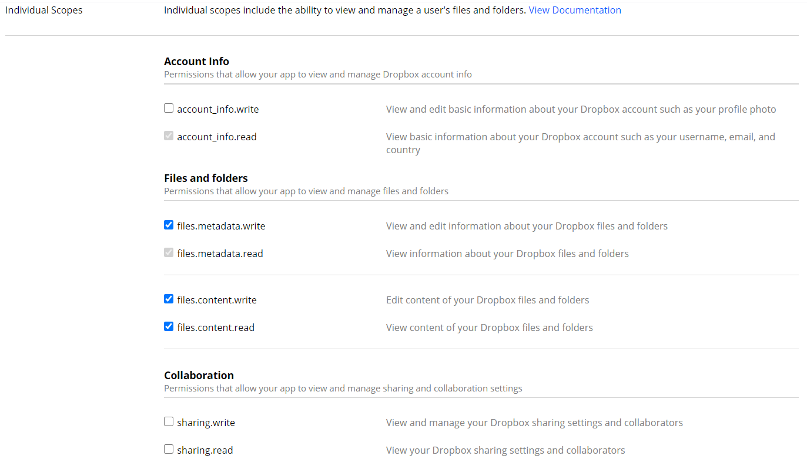
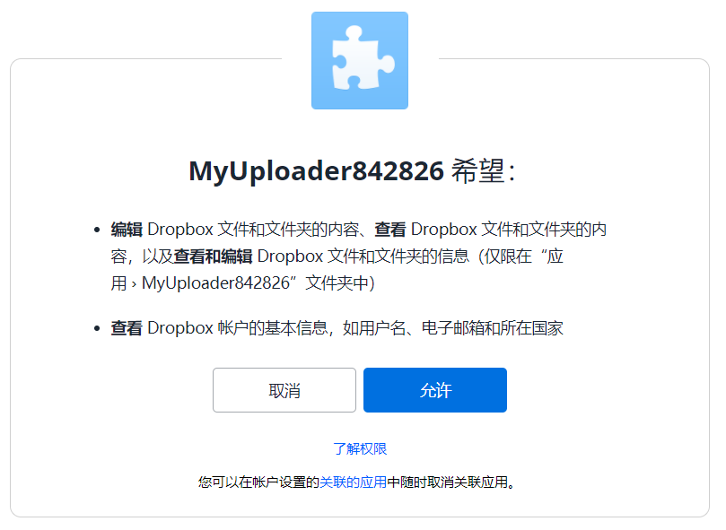
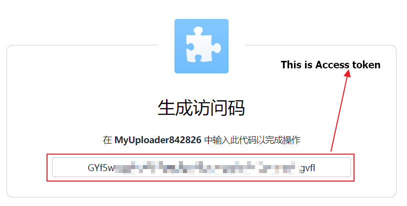

[中文说明](doc/readme-zh_cn.md)

### What can it do?

- Backup folders, files, MySQL databases.
- Encrypt file with zip format.
- Number based rolling backup. Keep the number of backup files you designated both local and cloud, Old backup files will be automatically deleted.
- Auto transfer to Dropbox.
- GMail notice.
   

### Installation

``` shell
git clone https://github.com/flatblowfish/server-backup.git
cd server-backup
chmod +x backup.sh
./backup.sh
```

### Configuration

All of the configuration options can be found in the config.sh file. Most of the options are intuitive. Only explain some important, fuzzy options below.

```shell
#
# optional: debug/info/error
# For the first time, set it to debug to find errors.
#
log_level=debug
#
# Keep how many backup files
# When a new backup file completed, and the number of backup files exceeds number_to_keep, old backup files will be deleted
#
number_to_keep=3
#
# Mark different server backups
# Also used in mail function to mark different backup notices
#
backup_prefix=""
#
# Dropbox folder to store backups
# For one Dropbox app, you can make many folders
#
dropbox_folder=""
#
# Mail account
# Only support Gmail now
#
mail_account=""
#
# Not dump MySQL databases by leaving it blank
#
mysql_root_password=""
#
# Encrypt password
# Not encrypt backup file by leaving it blank
#
encrypt_password=""
#
# Mail password
# Not send mail by leaving it blank
#
mail_password=""
```

### Dropbox Configuration - Get App key、App secret、Access token

1. Log in to Dropbox, open https://www.dropbox.com/developers/apps/create , Click on "Create App".

2. Select "Choose an API: Scoped Access"; "Choose the type of access you need: App folder"; "Name your app: "App Name" (must be unique) . Click on "Create App".

   

3. Record App key、App secret.

   

4. Switch to tab "permissions" and check "files.metadata.read/write" and "files.content.read/write", Click on "Submit".

   

5. Get Access token. Open https://www.dropbox.com/oauth2/authorize?client_id=App-key&token_access_type=offline&response_type=code, **Where the client_id is "App key", Remember to replace it**.

6. Attention! Dropbox-Uploader use Access token to generate Refresh token, you can find it in config file: ~/.dropbox_uploader. **Access token can only be used once**.

   
   
